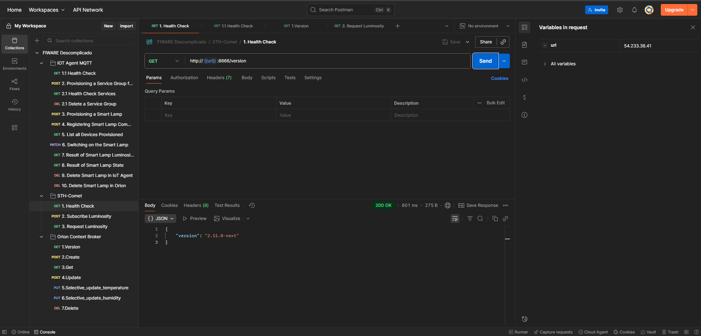
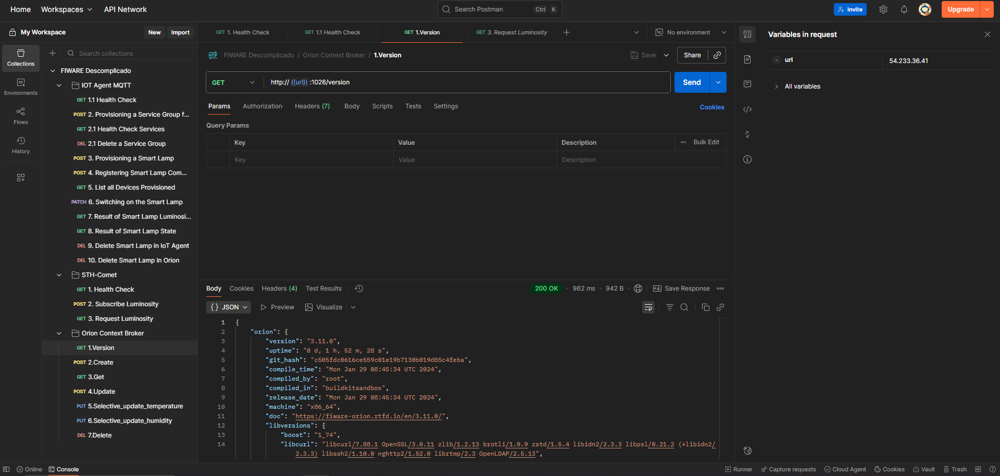
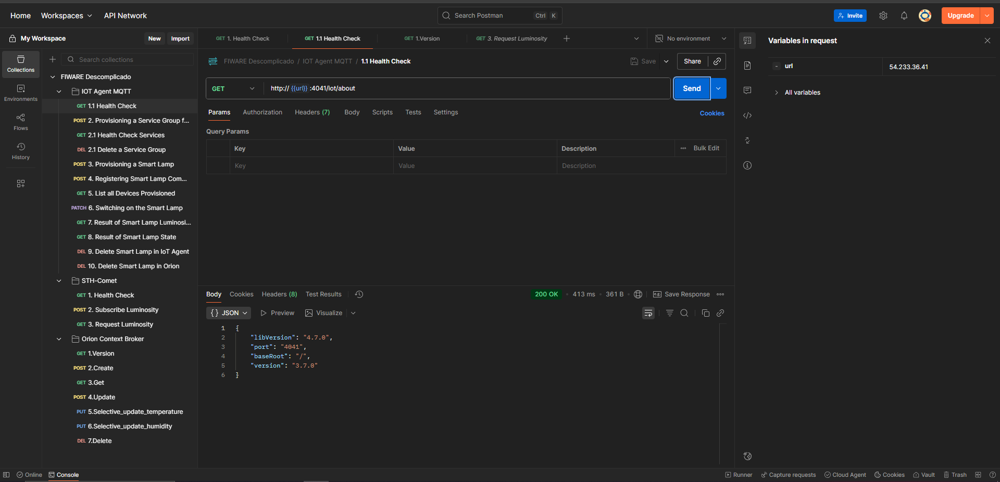

# CP5-Edge-Computing-Arquitetura-IoT-FIWARE-Vinheria


## 👥 Integrantes
- **Enzo Augusto Lima da Silva** – RM: 562249  
- **Gustavo Neres dos Santos** – RM: 561785  
- **Pedro Marchese** – RM: 563339  
- **Rafaell Santiago** – RM: 563486  

---

## 🎯 Objetivo
Este projeto tem como objetivo implementar uma arquitetura IoT baseada em FIWARE aplicada ao contexto da Vinheria Inteligente, monitorando e controlando variáveis ambientais essenciais, como temperatura, umidade, luminosidade e alagamento, para garantir a qualidade e a segurança do ambiente de produção.

A solução utiliza um microcontrolador ESP32 como dispositivo IoT, responsável por coletar dados e enviar informações à plataforma FIWARE hospedada em uma instância EC2 da AWS (máquina virtual Linux), permitindo a comunicação em tempo real via protocolo MQTT.

---

## ⚙️ Arquitetura da Solução

**Componentes principais:**
- **ESP32 (simulado no Wokwi):** coleta e envia dados de sensores.  
- **Sensores simulados:**
  - DHT22 → Temperatura e Umidade  
  - LDR (simulado por potenciômetro) → Luminosidade  
  - Sensor Ultrassônico (simulado por potenciômetro) → Alagamento  
- **Broker MQTT (Mosquitto):** intermedia a comunicação entre o dispositivo e o FIWARE.  
- **FIWARE IoT Agent + Orion Context Broker:** processa e armazena os dados dos sensores em tempo real.  
- **AWS EC2 (Ubuntu Server):** máquina virtual que hospeda os serviços FIWARE.

--

## 🖥️ Criação da Instância EC2 e Deploy do FIWARE

### 1. Criar a Instância EC2

  1. Acesse [AWS EC2](https://aws.amazon.com/ec2/) → Launch Instance
  2. Escolha **Ubuntu Server 24.04 LTS**
  3. Tipo de instância: `t2.micro` (Free Tier)
  4. Configurea o **Par de Chaves (SSH)** e baixe o `.pem`
  5. Configure a **Segurança** com as portas abertas:
  - 22 → SSH
  - 1883 → MQTT-broker
  - 1026 → Orion 
  - 8666 → sth-comet
  - 4041 → iot-agent-MQTT
  - 27017 → mongo-db

### 2. Conectar via SSH
```bash
1. Primeiro ir até o sua maquina virtual no teminal de comando

- ssh -i nome-da-chave.pem ubuntu@<IP-PUBLICO-DA-EC2>

2. Instalar FIWARE

  - sudo apt update
  - sudo apt install docker.io 
  - sudo apt install docker-compose
  - ls fiware
  - cd fiware
  - sudo docker-compose up -d
```
**Observação: O diretório fiware já contém o docker-compose configurado com os containers necessários e portas abertas.**

---

## 💻 Código-fonte

O código principal do ESP32 encontra-se no arquivo /index.ino, responsável por:

- Conectar o dispositivo à rede Wi-Fi.

- Publicar dados de sensores nos tópicos MQTT.

- Receber comandos de controle do FIWARE (ligar/desligar LED).

- Enviar dados formatados para o serial monitor.
    
    `Exemplo de saída no ESP32:`
    ```bash
        Conectado ao broker MQTT!
        LED desligado (enviado ao broker)
        Luminosidade: 24
        Umidade: 22.00 % | Temperatura: 49.00 °C
        Alagamento: 0
    ```
---

## 🧠 Detalhes da Implementação

- O ESP32 conecta à rede Wi-Fi simulada (Wokwi-GUEST) e publica dados MQTT no broker FIWARE.

- A cada 10 segundos, envia os valores de temperatura, umidade, luminosidade e alagamento.

- O LED embarcado é controlado remotamente via comandos MQTT enviados pelo FIWARE.

---

## 🧾 Prints e Vídeo

`Link para o simuladow Wokwi:` https://wokwi.com/projects/444271886745184257

`Prints da conexão da maquina virtual ao postman`

**Requisitos necessários para aplicação**
- IP público da máquina virtual na URL [54.233.36.41]
- Verificar se as portas estão abertas e recebendo os dados
- Se der 200 OK , está tudo certo






## 🧩 Conclusão

O projeto demonstrou com sucesso a integração completa entre dispositivo IoT (ESP32) e plataforma FIWARE, validando os conceitos de Edge Computing e IoT distribuído.
A arquitetura provou-se escalável, replicável e alinhada aos princípios de interoperabilidade propostos pelo ecossistema FIWARE.